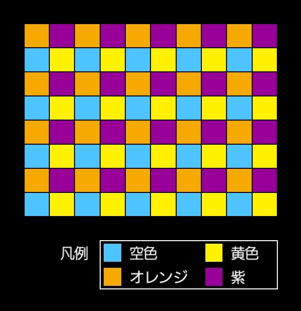
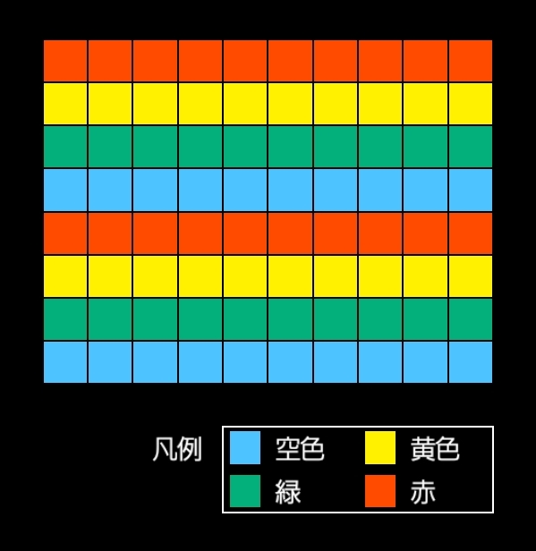
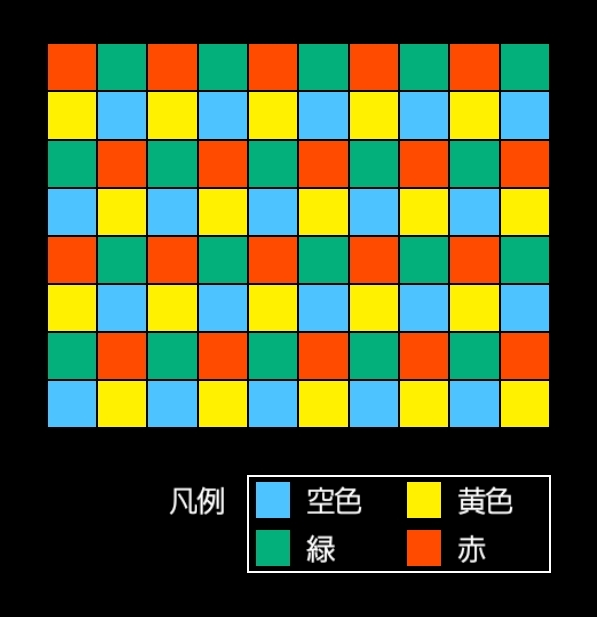

## パリティ・サンプル画像集

パリティに関するサンプル画像集です。

[このフォルダ](https://github.com/Ogonek-Macron/Parity-Knowledge/tree/main/images)にあるすべての画像はフリー素材です。良識の範囲でご自由にお使いいただけます。

以下、画像の一覧を示します。

### 各パリティ個別画像
#### 二色パリティ
* Rule:201（縦パリティ） 

* Rule:210（横パリティ） 

* Rule:211（市松パリティ） 

#### 四色パリティ
* Rule:200（四色格子パリティ） 

* Rule:401（四色縦パリティ） 

* Rule:410（四色横パリティ） 

* Rule:421 

* Rule:412 

* Rule:411 

* Rule:413 

### 備考
これらの画像では、『カラーユニバーサルデザイン推奨配色セット ガイドブック』を参考に配色を決定しています（[リンク](https://jfly.uni-koeln.de/colorset/)）。
